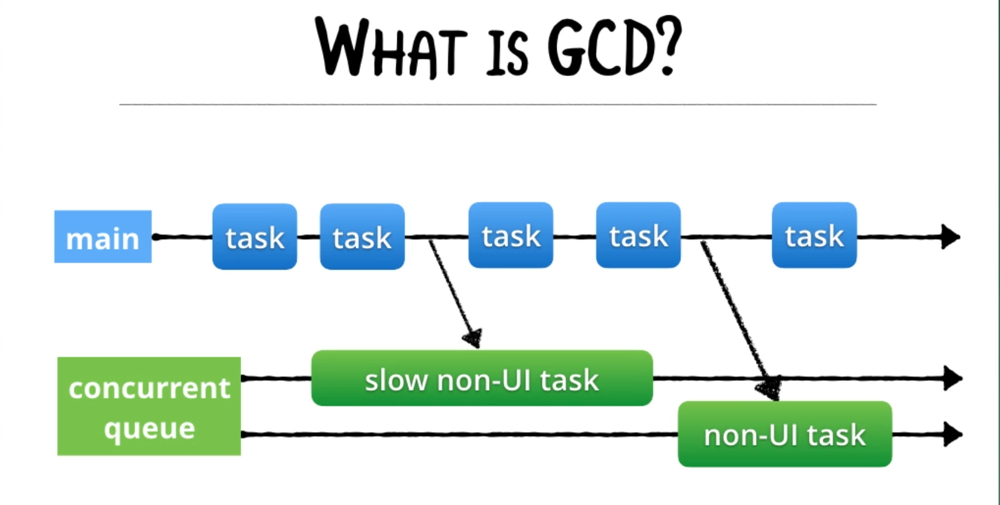

## Concurrency

Grand Central Dispatch is a technology that is designed to make the execution of tasks on multicore hardware performant and straightforward. It can do this because it operates at the system level. Your application operates in a sandbox, which means that it is unaware of other processes running on the system at the same time. Because Grand Central Dispatch operates at the system level, it has an accurate view of the processes that are running and the resources that are available.



We also have Operations:


In general, you can use this rule:
- GCD is used for simple jobs
- Operations are used for complex jobs

### Queues & Threads

The system provides many global queues you can use.  In total, we get 5 queues (1 serial queue and 4 concurrent queues).

The main queue is serial, it only runs on 1 thread which is the "main thread".


#### QOS Levels

- **userInteractive**: Rarely used; it's for tasks that must be done practically as fast as the main queue
- **userInitiated**: Tasks initiated from UI (ie. tapping a button, then opening a document)
- **utility**: I/O related tasks
- **background**: For tasks the user is not directly aware of (DB maintenance, syncing, backups etc..)
- **default**: If you don't specify a queue, you will be using this one.
- **unspecified**

You can also create your own DispatchQueues if you'd like.  They are **serial by default**.


Serial vs Concurrent queues just tell you how many threads are involved.
- Serial = 1 thread; Tasks execute FIFO
- Concurrent = More than 1 thread (it can run more than 1 task simultaneously)


Whereas, synchronous vs asynchronous tells whether the current queue has to wait for the task to finish or not.


#### Using Queues

How do you get the .userInitiated global dispatch queue?
```swift
let userQueue = DispatchQueue.global(qos: .userInitiated)
```

How do you get the .default global dispatch queue?
```swift
let defaultQueue = DispatchQueue.global()
```

How do you get the main queue?
```swift
let mainQueue = DispatchQueue.main
```

#### Run Async Tasks on a Global Concurrent Queue
To demonstrate that tasks are running asynchronously on a global (background) queue, see the example below.  

You could use this type of setup when you have a bunch of tasks that need to be spun off on a background thread, but the order of task execution doesn't particularly matter.

```swift
import Foundation

func task1() {
  print("Task 1 started")
  // make task1 take longer than task2
  sleep(1)
  print("Task 1 finished")
}

func task2() {
  print("Task 2 started")
  print("Task 2 finished")
}

public func duration(_ block: () -> ()) -> TimeInterval {
  let startTime = Date()
  block()
  return Date().timeIntervalSince(startTime)
}

/ TODO: Get the .userInitiated global dispatch queue
let userQueue = DispatchQueue.global(qos: .userInitiated)

// TODO: Get the .default global dispatch queue
let defaultQueue = DispatchQueue.global()

// TODO: Get the main queue
let mainQueue = DispatchQueue.main

// TODO: Dispatch tasks onto the userInitated queue

duration {
    userQueue.async {
        task1()
    }
    userQueue.async {
        task2()
    }
}

``` 

The above code will print out the following:


#### Run Async Tasks on a Private Serial Queue

The only global serial queue is DispatchQueue.main, but you can create a private serial queue. 
**Note** that .serial is the default attribute for a private dispatch queue.

So, if we want to declare a serial global queue that will execute tasks in FIFO order, here's what we would do:

1) Declare the Serial queue:
```swift
let mySerialQueue = DispatchQueue(label: "com.raywenderlich.serial")
```
We are providing a label to the queue so that we can identify it during debugging.

2) Execute the task1() and task2() method above in a FIFO fashion:
```swift
duration {
    mySerialQueue.async {
        task1()
    }
    mySerialQueue.async {
        task2()
    }
}
```

The above code will print out the following:


You see above that task 1 started and finished before task 2 could even start.  That is a serial queue.

#### Run Async Tasks on a Private Concurrent Queue

You have a bunch of user actions that you'd like to keep separate from the global concurrent queue, then you can use this setup:

```swift
let workerQueue = DispatchQueue(label: "com.raywenderlich.worker", attributes: .concurrent)

duration {
    workerQueue.async {
        task1()
    }
    workerQueue.async {
        task2()
    }
}
```

If you are running this code after the private serial queue code, you will see output showing that the private concurrent queue's tasks execute in the same order as the Global Concurrent code did.

#### Dispatch Work Items

A DispatchWorkItem encapsulates work to be performed on a dispatch queue or a dispatch group. It is primarily used in scenarios where we require the capability of delaying or canceling a block of code from executing.

It lets us cancel an enqueued task, however, we can cancel the task only before it reaches the head of a queue and starts executing.

We can declare a ```DispatchWorkItem``` by doing the following:

```swift
let workItem = DispatchWorkItem {
    task1()
}
```

Then, we can execute the work item like this:
```swift
userQueue.async(execute: workItem)
```

Now, if we really need workItem to finish before we can continue, we call ```.wait``` to tell the system to give it priority.
```swift
print(">> Waiting for task 1...")

if workItem.wait(timeout: .now() + 3) == .timedOut {
    print("I got tired of waiting")
} else {
    print("Work item completed.")
}
```

Dispatch Work Items are very helpful when you want to know when a particular task executed, so that you can do something else in response.  For example, let's say you do some background task and when it finishes, only then would you want to update the User Interface code.  Here is some helper code for this example:

```swift
enum Queues { case mainQ, userQ }
// TODO later: Set specific key for each queue.

let specificKey = DispatchSpecificKey<Queues>()
mainQueue.setSpecific(key: specificKey, value: .mainQ)
userQueue.setSpecific(key: specificKey, value: .userQ)

func whichQueue(workItem: String) {
  switch DispatchQueue.getSpecific(key: specificKey) {
  case .mainQ:
    print(">> \(workItem) is running on mainQueue")
  case .userQ:
    print(">> \(workItem) is running on userQueue")
  case .none:
    break
  }
}
```

Now, let's create the Dispatch Work Items:
```swift
let backgroundWorkItem = DispatchWorkItem {
    task1()
    whichQueue(workItem: "backgroundWorkItem")
}
let updateUIWorkItem = DispatchWorkItem {
    task2()
    whichQueue(workItem: "updateUIWorkItem")
}
```

Now, we want the ```backgroundWorkItem``` to notify the ```updateUIWorkItem``` when it's complete, so that we can update the UI:

```swift
userQueue.async(execute: backgroundWorkItem)
backgroundWorkItem.notify(queue: mainQueue, execute: updateUIWorkItem)
```

[Dispatch Work Item](https://betterprogramming.pub/a-deep-dive-into-dispatchworkitem-274548357dea)

### Groups & Semaphores

#### Dispatch Groups

Sometimes, instead of just tossing a job into a queue, you need to process a group of jobs. They don’t all have to run at the same time, but you need to know when they have all completed. Apple provides Dispatch Groups for this exact scenario.

The aptly named ```DispatchGroup``` class is what you’ll use when you want to track the completion of a group of tasks.

```swift
let group = DispatchGroup()

someQueue.async(group: group) { ... your work ... } 
someQueue.async(group: group) { ... more work .... }
someOtherQueue.async(group: group) { ... other work ... } 

group.notify(queue: DispatchQueue.main) { [weak self] in
  self?.textLabel.text = "All jobs have completed"
}

```

As seen in the example code above, groups are not hardwired to a single dispatch queue. You can use a single group, yet submit jobs to multiple queues, depending on the priority of the task that needs to be run. DispatchGroups provide a notify(queue:) method, which you can use to be notified as soon as every job submitted has finished.


The ```notify``` method takes a dispatch queue as a parameter.  Usually, you will end up using the main queue to update something in your UI.  But, there could be other queues that you might use.

In order to use dispatch groups, you need to tell the group when to ```enter()``` and when to ```leave()```.  You should almost always use ```defer``` to leave a dispatch group:

```swift
import UIKit
import PlaygroundSupport

PlaygroundPage.current.needsIndefiniteExecution = true

let group = DispatchGroup()
let queue = DispatchQueue.global(qos: .userInitiated)

let base = "https://wolverine.raywenderlich.com/books/con/image-from-rawpixel-id-"
let ids = [466881, 466910, 466925, 466931, 466978, 467028, 467032, 467042, 467052]

var images: [UIImage] = []

for id in ids {
  guard let url = URL(string: "\(base)\(id)-jpeg.jpg") else { continue }
  
    print("**** Entering group...")
  group.enter()
  
  let task = URLSession.shared.dataTask(with: url) { data, _, error in
    defer {
        print("**** Leaving group...")
        group.leave()
    }
    
    if error == nil,
      let data = data,
      let image = UIImage(data: data) {
      images.append(image)
    }
  }
  
  task.resume()
}

group.notify(queue: queue) {
  images[0]
  
  //: Make sure to tell the playground you're done so it stops.
  PlaygroundPage.current.finishExecution()
}
```

#### Semaphores

There are times when you really need to control how many threads have access to a shared resource. 

Scenario:

If you’re downloading data from the network, for example, you may wish to limit how many downloads happen at once.

You’ll use a dispatch queue to offload the work, and you’ll use dispatch groups so that you know when all the downloads have completed. However, you only want to allow four downloads to happen at once because you know the data you’re getting is quite large and resource-heavy to process.

By using a DispatchSemaphore, you can handle exactly that use case. Before any desired use of the resource, you simply call the ```wait``` method, which is a synchronous function, and your thread will pause execution until the resource is available. If nothing has claimed ownership yet, you immediately get access. If somebody else has it, you’ll wait until they ```signal``` that they’re done with it.


When creating a semaphore, you specify how many concurrent accesses to the resource are allowed. If you wish to enable four network downloads at once, then you pass in 4. If you’re trying to lock a resource for exclusive access, then you’d just specify 1.

In this example, we can try to download 10 items but set the ```value``` property of the ```DispatchSemaphore``` to 4 so that only 4 items are downloaded:

```swift

import UIKit
import PlaygroundSupport

PlaygroundPage.current.needsIndefiniteExecution = true

let group = DispatchGroup()
let queue = DispatchQueue.global(qos: .userInteractive)

let semaphore = DispatchSemaphore(value: 4)

for i in 1...10 {
  queue.async(group: group) {
    semaphore.wait()
    defer { semaphore.signal() }

    print("Downloading image \(i)")

    // Simulate a network wait
    Thread.sleep(forTimeInterval: 3)

    print("Downloaded image \(i)")
  }
}

// Because we've not specified a time, this will wait indefinitely
group.wait()

PlaygroundPage.current.finishExecution()

```

**Note**, we are using ```defer``` again to ```signal``` to the DispatchSemaphore that we are done with the resource.


