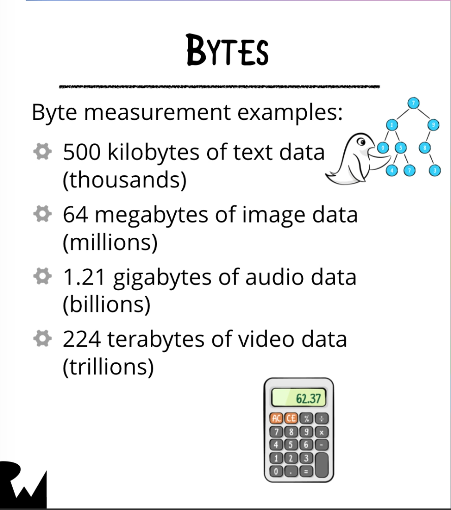

## Saving Data in iOS

In terms of saving data in iOS, different types of data can have vastly different storage requirements on disk:




You can store different data types in iOS:


### FileManager
To access the user's documents directory, create an extension that contains a computed property to grab the user's document directory:
```swift
import Foundation

extension FileManager {
	static var documentDirectoryURL: URL {
		`default`.urls(for: .documentDirectory, in: .userDomainMask)[0]
	}
}

print(FileManager.documentDirectoryURL)
```

Note: Since "default" is a static property of FileManager, you don't need to write it this way:
```swift
FileManager.default.urls(for: .documentDirectory, in: .userDomainMask)[0]
```

We can exclude the "FileManager" part of that, but since "default" is a Swift keyword, we need to surround it with backticks to tell the compiler that it is escaping.


### Files

### URLs
