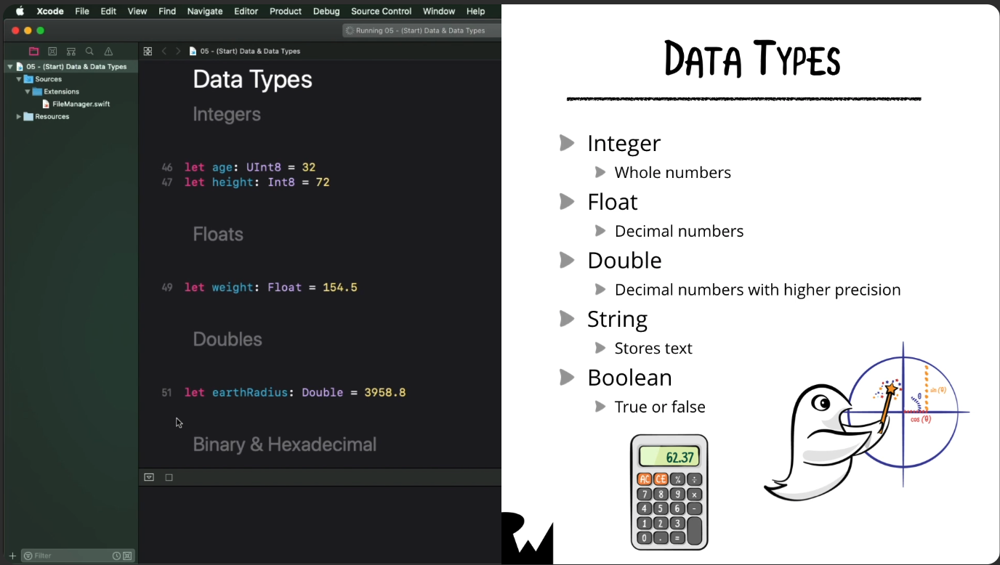
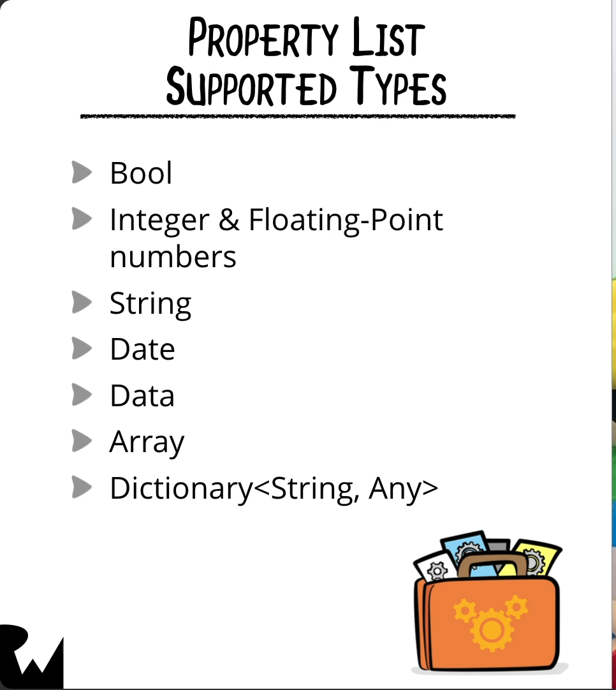

## Saving Data in iOS

In terms of saving data in iOS, different types of data can have vastly different storage requirements on disk:


You can store different data types in iOS:


### Files & Data
To access the user's documents directory, create an extension that contains a computed property to grab the user's document directory:
```swift
import Foundation

extension FileManager {
	static var documentDirectoryURL: URL {
		`default`.urls(for: .documentDirectory, in: .userDomainMask)[0]
	}
}

print(FileManager.documentDirectoryURL)
```

Note: Since ```default``` is a static property of ```FileManager```, you don't need to write it this way:
```swift
FileManager.default.urls(for: .documentDirectory, in: .userDomainMask)[0]
```

We can exclude the ```FileManager``` part of that, but since ```default``` is a Swift keyword, we need to surround it with backticks to tell the compiler that it is escaping.

If you want to see what the path of the documents directory actually is, you can use the ```path``` property:

```swift
FileManager.documentsDirectoryURL.path
```

The ```path``` property just returns a string containing the actual path to the documents directory on disk.

Now, there are mainly 2 ways of creating a file in the documents directory:

**Method # 1:**
```swift
let remindersDataURL = URL(fileURLWithPath: "Reminders", relativeTo: FileManager.documentsDirectoryURL).appendingPathExtension("txt")

print(remindersDataURL.path)
```

The ```URL(fileURLWithPath:relativeTo:).appendingPathExtension(_:)``` method creates a new file with an extension that is specified inside the documents directory.

**Method # 2:**
```swift
let stringURL = FileManager.documentsDirectoryURL.appendingPathComponent("String").appendingPathExtension("txt")
print(stringURL.path)
```

In method # 2, we instead use ```appendingPathComponent(_:)``` and ```appendingPathExtension(_:)``` to create the file.

Both methods create the same result.

There is a handy property called ```lastPathComponent``` that will return you the filename and the extension as long as the URL is a file itself.

```swift
stringURL.lastPathComponent
```

There is a temporary directory that FileManager can give you access to if you need a place to store short-term data that you do not ever plan on persisting between app launches:
```swift
let temporaryDirectoryURL = FileManager.default.temporaryDirectory
```

This directory called ```tmp``` is at the same level as the ```Documents``` directory in the user's sandbox.


#### Data Types


In order to read and write data from disk, you would do the following:
```swift
let favoriteBytes: [UInt8] = [
  240,          159,          152,          184,
  240,          159,          152,          185,
  0b1111_0000,  0b1001_1111,  0b1001_1000,  186,
  0xF0,         0x9F,         0x98,         187
]

// Convert to Data
let favoriteBytesData = Data(favoriteBytes)
// Create the URL for the exact file name where you will save this data
let favoriteBytesURL = URL(
  fileURLWithPath: "Favorite Bytes",
  relativeTo: FileManager.documentsDirectoryURL).appendingPathExtension("txt")

print(FileManager.documentsDirectoryURL.path)
print(favoriteBytesURL.lastPathComponent)

// Saving data to disk...
do {
  try favoriteBytesData.write(to: favoriteBytesURL)
} catch {
  print("Error occurred!")
}

// Loading data from disk...
var savedFavoriteBytesData: Data?
do {
  savedFavoriteBytesData = try Data(contentsOf: favoriteBytesURL)
} catch {
  print("Error occurred!")
}
```

You can also check that the saved data you've retrieved from disk is the same as the data you wrote to disk by using the equality operator ```==```

Now, if you know that the data you've saved to a file in the documents directory contains string data, you can retrieve that string data and print it's content or use it however you like:

```swift
if let savedData = savedFavoriteBytesData {
  let stringData = String(data: savedData, encoding: .utf8)
  print(stringData!)
}
```
In the above snippet, ```savedFavoriteBytesData``` was an optional Data variable, so I used optional binding to unwrap it first.

If you want to make sure the file gets written to disk and is not corrupted even in the event that the system should crash, this API call can be used:

```func write(to url: URL, atomically useAuxiliaryFile: Bool, encoding enc: UInt) throws```

Example:
```swift
try stringData?.write(to: catsURL, atomically: true, encoding: .utf8)
let catsChallengeString = try String(contentsOf: catsURL)
print(catsChallengeString)
```


### JSON

If JSON files are stored within your XCode project, you can access that JSON data using the below API call:

```Bundle.main.url(forResource: <String?>, withExtension: <String?>)```

- ```Bundle``` is a representation of your app, it's code and it's resources.
All the files you add in XCode under your app target are referred to as the "App Bundle"
- ```main``` represents the current executable (in this case, your app)
- ```forResource``` is the name of the parameter you want the URL for
- ```withExtension``` is the extension of the file

#### JSON Decoder
In order to decode JSON data, we'd use the following code (as an example):
```swift
let decoder = JSONDecoder()
do {
  let sampleData = try Data(contentsOf: sampleJSONData)
  let sample = try decoder.decode(Sample.self, from: sampleData)
} catch let error {
  print(error)
}
```

The ```Sample``` type in this example, must conform to the ```Codable``` protocol in order for the ```JSONDecoder``` to work.

If your JSON file is stored within the user's documents directory instead of within the app's ```Bundle```, you'd use the same method as mentioned at the top of this article:

```swift
let jsonURL = URL(fileURLWithPath: "jsondata", relativeTo: FileManager.documentsDirectoryURL).appendingPathExtension("json")
```
Then, you can use the ```JSONDecoder()``` as before to decode the data at ```jsonURL```.

If you want to see all the files located in the documents directory, you can use this handy method:
```swift
print((try? FileManager.default.contentsOfDirectory(atPath: FileManager.documentsDirectoryURL.path)) ?? [])
```

#### JSON Encoder

To encode data you have stored in your app and save it to disk, you would use the following code (substitute the variable names as required):
```swift
import Foundation

private func encodeJSONToDisk() {
	let encoder = JSONEncoder()

	// Two Steps require a do-try-catch statement since both of them are throwing methods
	do {
		// 1. Encoding data
		let taskData = try encoder.encode(appTaskData.first?.tasks.last)
		let taskJSONURL = URL(fileURLWithPath: "Task", relativeTo: FileManager.documentsDirectoryURL).appendingPathExtension("json")
		// 2. Saving the data to ask.
		try taskData.write(to: taskJSONURL, options: .atomicWrite)
		// atomicWrite makes sure that it writes to a temp file, then to the permanent file
		// This is useful in case a crash might happen
	} catch let error {
		print(error)
	}
}
```

**Codable Hierarchies**

[Hacking With Swift's explanation of Codable Hierarchies](https://www.hackingwithswift.com/books/ios-swiftui/working-with-hierarchical-codable-data)

### Property Lists

This section is about saving and reading from Property Lists.  

#### Saving a plist to disk

Here are the supported Property List data types:



To save your data to a Plist file on disk, you'd use similar logic that you use to encode JSON to disk.  The only difference is the class that you instantiate which is called ```PropertyListEncoder```.

Here is a code snippet that shows how you would create the exact path with which you'd like to save your Plist to disk:

```swift
let tasksPListURL = URL(fileURLWithPath: "TaskPList", relativeTo: FileManager.documentsDirectoryURL).appendingPathExtension("json")
```

... and this code snippet is how you would actually save the data to disk in a plist file:

```swift
private func saveJSONToPList() {
		let encoder = PropertyListEncoder()
		encoder.outputFormat = .xml

		print("*** Task List Plist URL: \(tasksPListURL.path)")

		do {
				let tasksData = try encoder.encode(prioritizedTasks)
				try tasksData.write(to: tasksPListURL, options: .atomicWrite)
		} catch let error {
				print(error)
		}
}
```

Note the use of ```encoder.outputFormat = .xml```.  You should always make sure that you are setting the output format to XML for a Property List you plan on saving to disk.

#### Reading a plist file from disk

In order to read a plist file from disk, we can use the following code:

```swift
private func loadPlistFile() {
		guard FileManager.default.fileExists(atPath: tasksPListURL.path) else {
				return
		}

		let decoder = PropertyListDecoder()

		do {
				let tasksData = try Data(contentsOf: tasksPListURL)
				prioritizedTasks = try decoder.decode([PrioritizedTasks].self, from: tasksData)
		} catch let error {
				print(error)
		}
}
```
