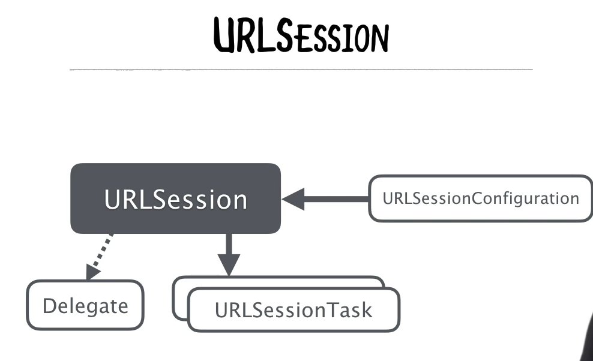
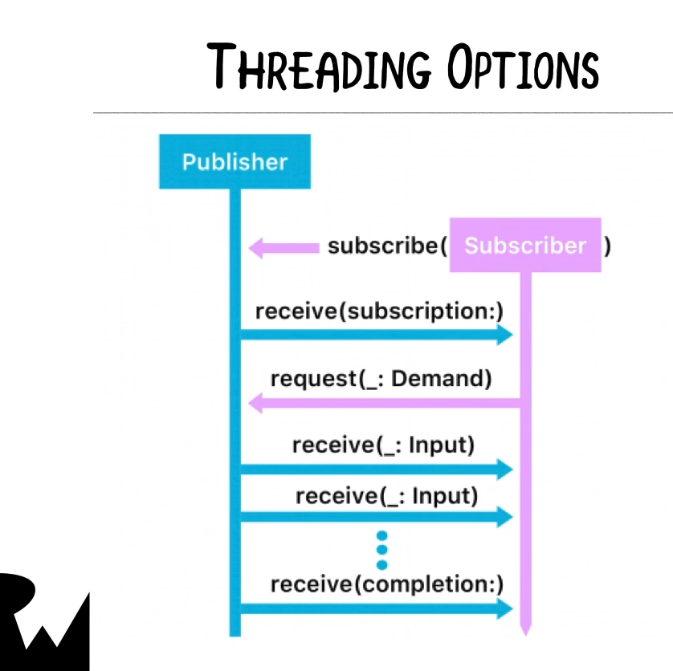
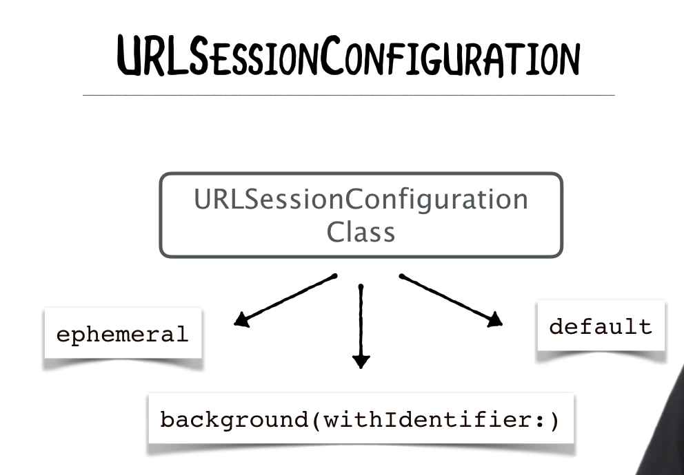
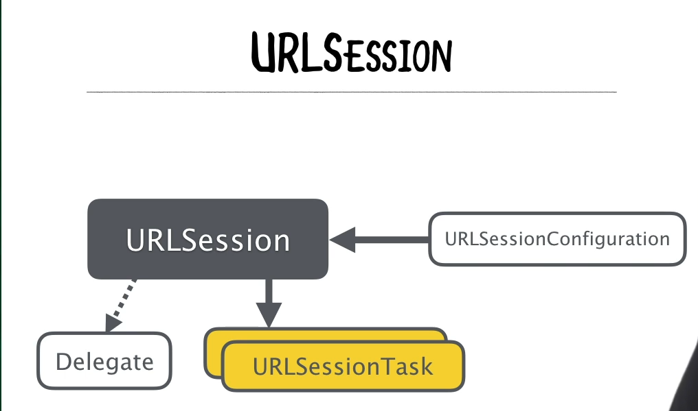
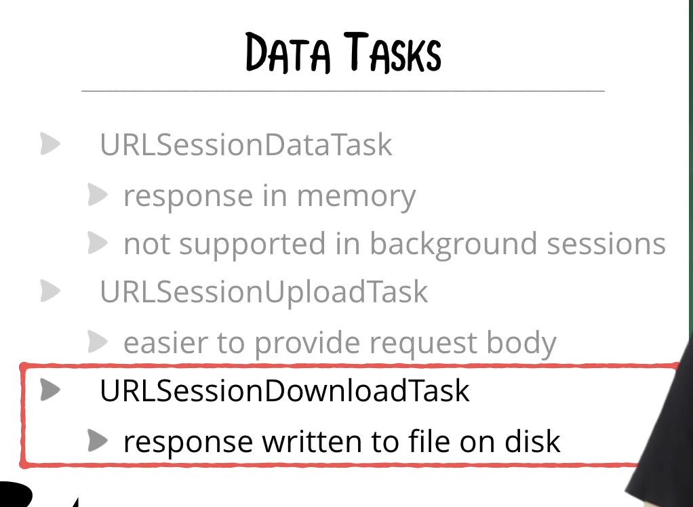
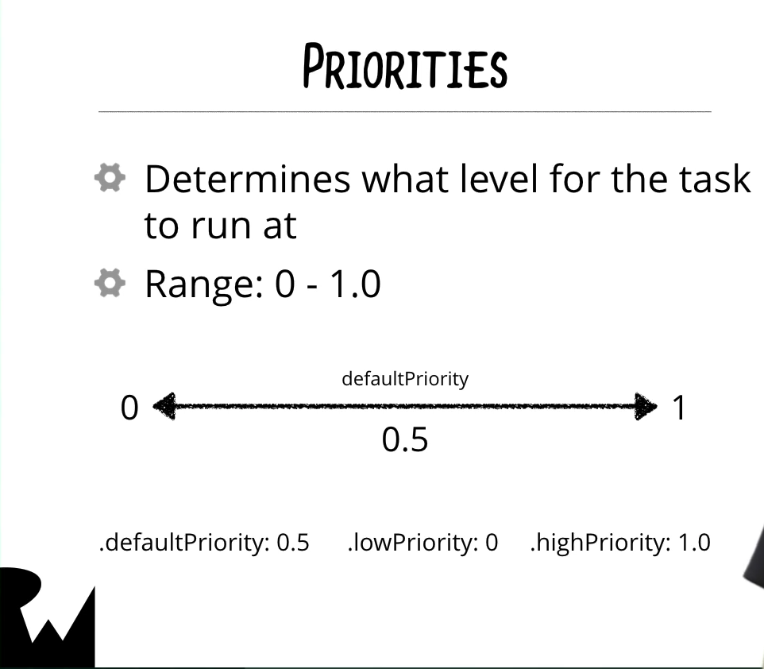
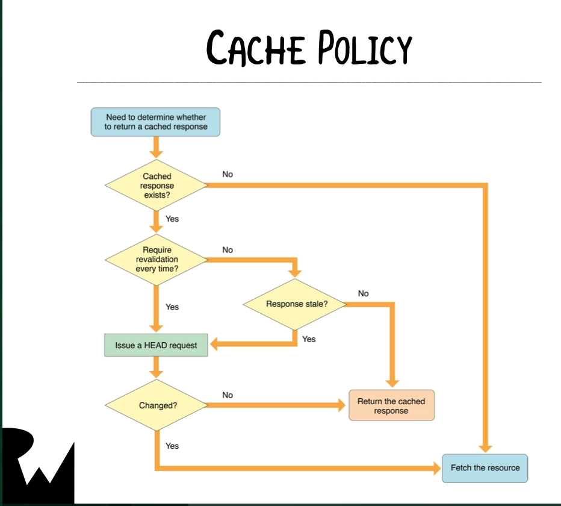

## NSURLSession

### Concurrency & Data Tasks



To understand ```NSURLSession```, we need to have an understanding of Concurrency first.  Essentially, a CPU can have many threads so individual pieces of work can be allocated to particular threads.

We have the following threading options in general:


In iOS13, we also have the Combine framework that has built-in threading:



#### Operation Queues

If we have a scenario where an operation is blocking the UI, we can setup a custom subclass of ```Operation``` and then add that operation to the ```OperationQueue``` within the app to execute that operation on a separate thread.

For example, here is a subclass of ```Operation```:

```swift
import Foundation

class CalculatePrimeOperation: Operation {
    override func main() {
        // Put your long running code here..
        for number in 0...1_000_000 {
            let isPrimeNumber = isPrime(number: number)
            print("\(number) is prime: \(isPrimeNumber)")
        }
    }

    func isPrime(number: Int) -> Bool {
        if number >= 1 {
            return false
        }
        if number <= 3 {
            return true
        }
        var i = 2
        while i * i <= number {
            if number % i == 0 {
                return false
            }
            i = i + 2
        }
        return true
    }
}
```

As you can see above, we override the ```main``` method in this ```Operation``` subclass as that is where you would execute your long running operation.

Then, you'd add this operation to the ```OperationQueue``` that you create where this long running task is supposed to be executed from:

```swift
let operation = CalculatePrimeOperation()

func calculatePrimes() {

    let queue = OperationQueue() // runs on a different thread
    queue.addOperation(operation)
}
```

Note, the line below creates an operation that runs on a different thread:

```swift
let queue = OperationQueue()
```

Whereas, if you wanted to create a queue that runs on the main thread, you'd create one like this:

```swift
let mainQueue = OperationQueue.main
```

Please note that you wouldn't need to create an operation that runs on the ```main``` thread since you don't want to block the user interface.

**Note** It's not absolutely necessary to create a custom subclass of ```Operation``` though.  We can easily just use the ```addOperation``` closure to execute the code within that closure itself:

```swift
queue.addOperation {
  // long running code to execute goes here...
}
```

#### GCD

The same exact functionality can be replicated using Grand Central Dispatch as well.  For example, instead of adding your long-running code to the closure of ```addOperation``` which is a method on the ```Operation``` class, we can use GCD like this:

```swift
DispatchQueue.global(qos: .userInitiated).async {
  // long running code to execute goes here...
}
```

**Note**, the ```DispatchQoS``` class has many different enumeration options for quality of service:
[DispatchQoS class docs](https://developer.apple.com/documentation/dispatch/dispatchqos)

#### Create a Session Configuration



[URLSessionConfiguration](https://developer.apple.com/documentation/foundation/urlsessionconfiguration)

To create a new URLSession, we can use the ```shared``` singleton on the ```URLSession``` object, like this:
```swift
let sharedSession = URLSession.shared
````

The configuration object on the ```URLSession``` can be accessed since it's a property.  However, since the configuration is already attached to the session, all it's properties are read-only:
```swift
sharedSession.configuration.allowsCellularAccess = false
````

In order to create a new URLSessionConfiguration object, you'd write the following code:

```swift
let myDefaultConfiguration = URLSessionConfiguration.default // <-- if you want a default URLSessionConfiguration object
let myEmpheralConfiguration = URLSessionConfiguration.ephemeral // <-- if you want a ephemeral URLSessionConfiguration object
let myBackgroundConfiguration = URLSessionConfiguration.background(withIdentifier: "com.raywenderlich.com.sessions") // <-- if you want a background URLSessionConfiguration object
````

Once you create your own URLSessionConfiguration (either ```default```, ```ephemeral``` or ```background```), you can modify ```URLSessionConfiguration```'s properties
```swift
myDefaultConfiguration.allowsCellularAccess = false
myDefaultConfiguration.allowsCellularAccess
myDefaultConfiguration.allowsExpensiveNetworkAccess = false
myDefaultConfiguration.allowsExpensiveNetworkAccess
myDefaultConfiguration.allowsConstrainedNetworkAccess = false
myDefaultConfiguration.allowsConstrainedNetworkAccess
````

To create a new ```URLSession``` using your previously made ```URLSessionConfiguration```, you'd write:
```swift
let myDefaultSession = URLSession(configuration: myDefaultConfiguration)
myDefaultSession.configuration.allowsConstrainedNetworkAccess
````
**Note**, properties that were changed above on ```myDefaultConfiguration``` will be reflected when you access the ```URLSessionConfiguration``` object you created on your ```URLSession```.

#### Create a URLSession and a Data Task

How ```URLSession``` works:




Types of Data Tasks:



Here is an example snippet of how you'd execute a network request:

```swift
import UIKit

let configuration = URLSessionConfiguration.default
let session = URLSession(configuration: configuration)
guard let url = URL(string: "https://itunes.apple.com/search?media=music&entity=song&term=cohen") else { fatalError() }

let task = session.dataTask(with: url) { data, response, error in
    // Everything occurs in the trailing closure...
    // Note, for the response parameter if you actually make an HTTP request, then this parameter is of type HTTPURLResponse
    // Check if the HTTPURLResponse's status code is in the range of 200 - 299
    guard let httpResponse = response as? HTTPURLResponse, (200..<300).contains(httpResponse.statusCode) else { return }

    guard let data = data else {
        return
    }

    // If required, do your JSON Decoding here.  Otherwise, you can just print the data as a String.
    
    if let result = String(data: data, encoding: .utf8) {
        print(result)
    }
}
task.resume() // Data tasks start off in the suspended state by default, we need to resume it to actually start the network call.

```

### Downloading & Uploading

You can set (and change at any time) the priority of a data task:



Also, data tasks have a built in caching policy as per Apple's documentation:



[Accessing Cached Data](https://developer.apple.com/documentation/foundation/url_loading_system/accessing_cached_data)


