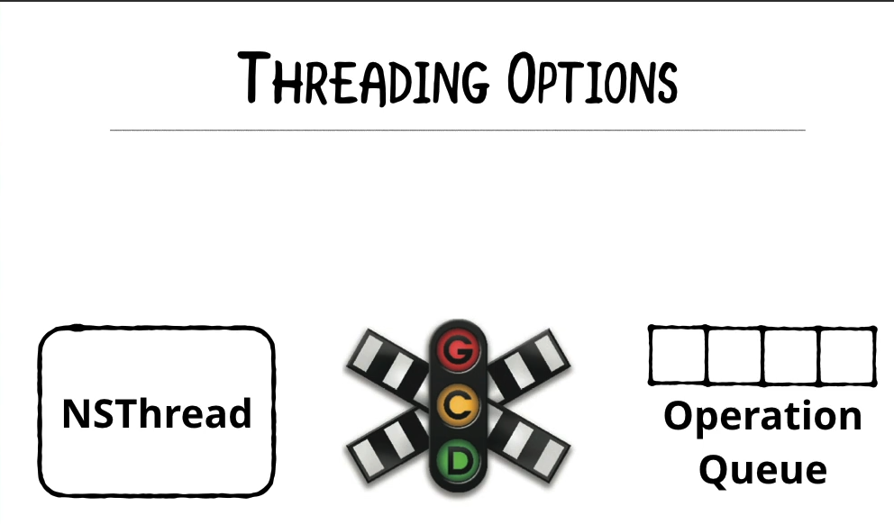

## NSURLSession

### Concurrency & Data Tasks


To understand NSURLSession, we need to have an understanding of Concurrency first.  Essentially, a CPU can have many threads so individual pieces of work can be allocated to particular threads.

We have the following threading options in general:



In iOS13, we also have the Combine framework that has built-in threading:


#### Operation Queues

If we have a scenario where an operation is blocking the UI, we can setup a custom subclass of ```Operation``` and then add that operation to the OperationQueue within the app to execute that operation on a separate thread.

For example, here is a subclass of ```Operation```:

```swift
import Foundation

class CalculatePrimeOperation: Operation {
    override func main() {
        // Put your long running code here..
        for number in 0...1_000_000 {
            let isPrimeNumber = isPrime(number: number)
            print("\(number) is prime: \(isPrimeNumber)")
        }
    }

    func isPrime(number: Int) -> Bool {
        if number >= 1 {
            return false
        }
        if number <= 3 {
            return true
        }
        var i = 2
        while i * i <= number {
            if number % i == 0 {
                return false
            }
            i = i + 2
        }
        return true
    }
}
```

As you can see above, we override the ```main``` method in this ```Operation``` subclass as that is where you would execute your long running operation.

Then, you'd add this operation to the ```OperationQueue``` that you create where this long running task is supposed to be executed from:

```swift
let operation = CalculatePrimeOperation()

func calculatePrimes() {

    let queue = OperationQueue() // runs on a different thread
    queue.addOperation(operation)
}
```

Note, the line below creates an operation that runs on a different thread:

```swift
let queue = OperationQueue()
```

Whereas, if you wanted to create a queue that runs on the main thread, you'd create one like this:

```swift
let mainQueue = OperationQueue.main
```

Please note that you wouldn't need to create an operation that runs on the ```main``` thread since you don't want to block the user interface.

**Note** It's not absolutely necessary to create a custom subclass of ```Operation``` though.  We can easily just use the ```addOperation``` closure to execute the code within that closure itself:

```swift
queue.addOperation {
  // long running code to execute goes here...
}
```

#### GCD

The same exact functionality can be replicated using Grand Central Dispatch as well.  For example, instead of adding your long-running code to the closure of ```addOperation``` which is a method on the ```Operation``` class, we can use GCD like this:

```swift
DispatchQueue.global(qos: .userInitiated).async {
  // long running code to execute goes here...
}
```

**Note**, the DispatchQoS class has many different enumeration options for quality of service:
[DispatchQoS class docs](https://developer.apple.com/documentation/dispatch/dispatchqos)
