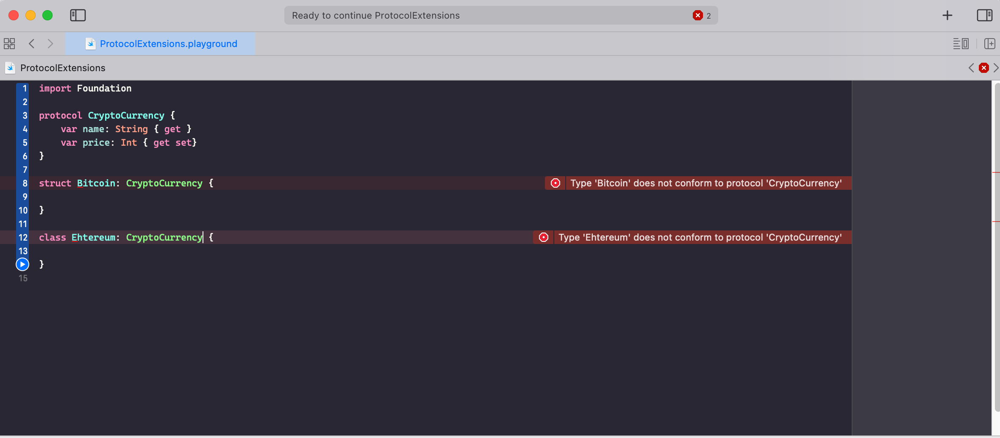
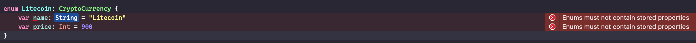

## Protocols

A protocol defines a blueprint of methods, properties, and other requirements that suit a particular task or piece of functionality. The protocol can then be adopted by a class, structure, or enumeration to provide an actual implementation of those requirements. Any type that satisfies the requirements of a protocol is said to conform to that protocol.

### Protocol Syntax

```swift
protocol MyProtocol {
	// variables
	// method signatures
}
```

Classes , structs, enums can adopt these protocol by placing protocol’s name after the type’s name, separated by a colon, as part of their definition. Multiple protocols can be listed, and are separated by commas:

```swift
struct SomeStructure: FirstProtocol, AnotherProtocol {
    // structure definition goes here
}
```

If a class has a superclass, list the superclass name before any protocols it adopts, followed by a comma:

```swift
class SomeClass: SomeSuperclass, FirstProtocol, AnotherProtocol {
    // class definition goes here
}
```

You might have already seen UIViewControllers implementing UITableview datasource and delegate protocols.

```swift
class ViewController: UIViewController, UITableViewDataSource, UITableViewDelegate { }
```

Although, the best practice is to group this in a separate extension of ViewController and implement the protocols.

```swift
class ViewController: UIViewController {}
extension ViewController: UITableViewDataSource, UITableViewDelegate
{
	//implement protocol methods ands variables here..
}
```

### Adding Properties to Protocols

- A protocol can have properties as well as methods that a class, enum or struct conforming to this protocol can implement.
- A protocol declaration only specifies the required property name and type. It doesn’t say anything about whether the property should be a stored one or a computed one.
- A protocol also specifies whether each property must be gettable or gettable and settable.
- Property requirements are always declared as variable properties, prefixed with the ```var``` keyword.
- Gettable and settable properties are indicated by writing { get set } after their type declaration, and gettable properties are indicated by writing { get }.


#### Real-Life Example

```swift
protocol CryptoCurrency {
    var name: String { get }
    var price: Int { get set}
}
```

Now, let's say I create a new class and a new struct that need to conform to this protocol:

```swift
struct Bitcoin: CryptoCurrency {
    
}

class Ethereum: CryptoCurrency {
    
}
```

XCode will tell you right away that you will need to conform to ```CryptoCurrency``` protocol by implementing the required variables:



When a protocol defines a property as ```gettable```, it means you can use this property as:
- a ```let``` constant
- a ```var```
- a computed property

However, ```{get set}``` limits you to having to declare this property as ```var```.  

##### Structs

For example, if we setup the Bitcoin struct this way, it will result in an error:

```swift
struct Bitcoin: CryptoCurrency {
    let name: String
    let price: Int
}
```

**Error**: Type 'Bitcoin' does not conform to protocol 'CryptoCurrency'

Since ```price``` is a ```{get set}``` type of property, it **must** be declared as a ```var```.  Here is the correct declaration of the Bitcoin struct:

```swift
struct Bitcoin: CryptoCurrency {
    let name: String
    var price: Int
}
```

##### Classes

An important distinction between how to use protocols in classes vs structs is that the protocol properties must be given initial values if a class conforms to a particular protocol.  Therefore, this would be the correct setup for the Ethereum class:

```swift
class Ethereum: CryptoCurrency {
    var name: String = "Ethereum"
    var price: Int = 800
}
```

##### Enums

Enums can also conform to protocols (although I can't see a reason to do so).  However, enums cannot contain stored properties.  So, you cannot do this:

```swift
enum Litecoin: CryptoCurrency {
    var name: String = "Litecoin"
    var price: Int = 900
}
```

If you do this, it will result in this type of error:


Instead, you can use computed properties:

```swift
enum Litecoin: CryptoCurrency {
    static var exchangeTradingPlatform: String {
        return "TSX"
    }
    var name: String {
        return "Litecoin"
    }
    var price: Int {
        get {
            return 150
        } set(newValue) {
            print("\(newValue)")
        }
    }
}
```

**Note** the use of the get { } and set { } syntax for the ```price``` property.  This is necessary when using computed properties in a value type.


##### Mutating

Let's say, for example, that we want to add a method to the protocol which will modify the price (which is settable).  There are 2 steps to do this:

1) Mark the method that is changing a settable property as ```mutating```.
2) In any value type object that conforms to this protocol, we must mark the same method as ```mutating```.  **Note**, in a reference type of object, we don't need to do this.

So, here is the new protocol with the mutating method:

```swift
protocol CryptoCurrency {
    var name: String { get }
    var price: Int { get set}
    mutating func transfer()
}
```

Now, in a struct or enum, we must implement ```transfer()``` but also mark it as mutating:

```swift
struct Bitcoin: CryptoCurrency {
    mutating func transfer() {
        price = 10000
        print("Transfer... \(self.name) with a price of \(self.price)")
    }
    let name: String
    var price: Int
}

enum Litecoin: CryptoCurrency {
    mutating func transfer() {
        price = 35
        print("Transfer... \(self.name) with a price of \(self.price)")
    }
    var name: String {
        return "Litecoin"
    }
    var price: Int {
        get {
            return 150
        } set(newValue) {
            print("\(newValue)")
        }
    }
}
```

However, in a class, we don't need to do that:

```swift
class Ethereum: CryptoCurrency {
    func transfer() {
        price = 100
        print("Transfer... \(self.name) with a price of \(self.price)")
    }
    var name: String = "Ethereum"
    var price: Int = 800
}
```

So, now if we instantiate a ```Bitcoin``` object (which is a struct), we can now modify the ```price``` (which is settable):

```swift
var btc = Bitcoin(name: "BTC", price: 9000)
btc.transfer()
```

This code will output:
"Transfer... BTC with a price of 10000"

However, if we change the price on a reference type:

```swift
var eth = Ethereum()
eth.transfer()
```

This code will output:
"Transfer... Ethereum with a price of 100"

##### Using Initializers in a Protocol

Let's say we want to make sure that any object that conforms to this protocol needs to use an initializer that takes in the name of the object:

```swift
protocol CryptoCurrency {
    var name: String { get }
    var price: Int { get set}
    mutating func transfer()
    init(name: String)
}
```

This will necessitate a few changes for value types vs reference types. 

**Value Types**

When implementing this initializer in a value type that conforms to a protocol that has an initializer method signature, you must ensure that any properties in the protocol are initialized with an initial value (if not done so in the initializer itself):

So both of these structs are valid:

```swift
struct Bitcoin: CryptoCurrency {
    init(name: String) {
        self.name = name
        self.price = 10000
    }
    
    mutating func transfer() {
        price = 10000
        print("Transfer... \(self.name) with a price of \(self.price)")
    }
    let name: String
    var price: Int
}
```

and... 

```swift
struct Bitcoin: CryptoCurrency {
    init(name: String) {
        self.name = name
    }
    
    mutating func transfer() {
        price = 10000
        print("Transfer... \(self.name) with a price of \(self.price)")
    }
    let name: String
    var price: Int = 10000
}
```

**Reference Types**

When implementing this initializer in a reference type that conforms to a protocol that has an initializer method signature, you must ensure that the initializer is prefixed with the ```required``` keyword:


```swift
class Ethereum: CryptoCurrency {
    required init(name: String) {
        self.name = name
    }
    
    func transfer() {
        price = 100
        print("Transfer... \(self.name) with a price of \(self.price)")
    }
    var name: String = "Ethereum"
    var price: Int = 800
}
```

##### Protocol Extensions

In the example below, we declare a protocol with a single property that is gettable.  We extend this protocol in order to create a default implementation of the protocol that our classes/structs can use.

The default implementation sets the ```rotates``` property to true, which is then directly accessible via the class instance ```fan```.

```swift
protocol Rotating {
    var rotates: Bool { get }
}

extension Rotating {
    var rotates: Bool {
        return true
    }
}

class Fan: Rotating {}
let fan = Fan()
fan.rotates
```