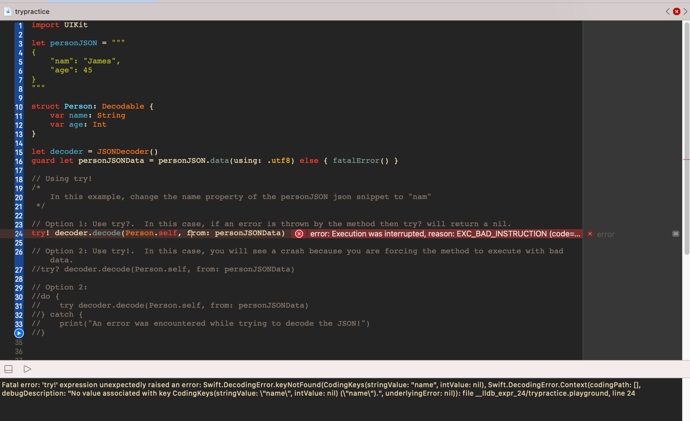
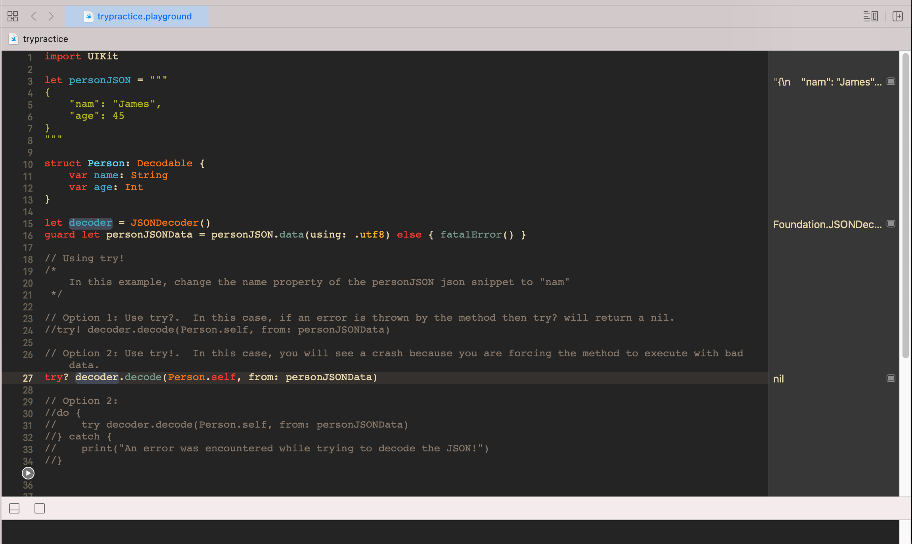
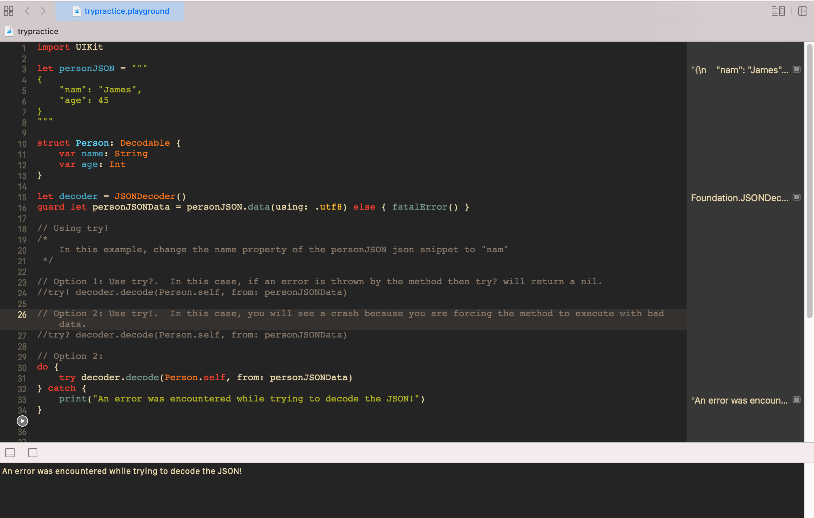

## try vs try? vs try!

To illustrate when and how to use try? vs try vs try!, let's use some sample code.

For example, let's say we have some JSON data such as the following:
```swift
let personJSON = """
{
    "name": "James",
    "age": 45
}
"""
```

.. and a ```Decodable``` struct associated to it:

```swift
struct Person: Decodable {
    var name: String
    var age: Int
}
```

Commonly in Swift, we need to decode the JSON.  But to illustrate how to use try vs try! vs try?, we need to have bad JSON data to illustrate the usage of these keywords.  So, let's change our ```personJSON``` data so that it's incorrect, as follows:

```swift
let personJSON = """
{
    "nam": "James",
    "age": 45
}
"""
```

Now, there are 3 examples of using the try keyword:

1) The try! keyword
It's really never a good idea to use try! unless you are 100% sure that the data cannot be malformed/bad.  In this example, if you use the following line, it will result in a crash:

```swift
try! decoder.decode(Person.self, from: personJSONData)
```



It is crashing because even though the ```decode``` method throws an error, you are forcing the data to be converted even though it's bad.  Therefore, the program will crash.

2) The try? keyword

```swift
try? decoder.decode(Person.self, from: personJSONData)
```



```try?``` is effectively saying "attempt to run this method, but if the method returns an error then return nil"


3) The do-catch block and using try

The last way of using try is within a do-catch block so that the error is caught:

```swift
do {
    try decoder.decode(Person.self, from: personJSONData)
} catch {
    print("An error was encountered while trying to decode the JSON!")
}
```


