## Creating a Collection View using Compositional Flow Layout (Storyboard)

### Initial Setup of the Collection View

If you need to create a collection view via Interface Builder, then first you'd start by navigating to Main.storyboard and dragging a Collection View onto the canvas:

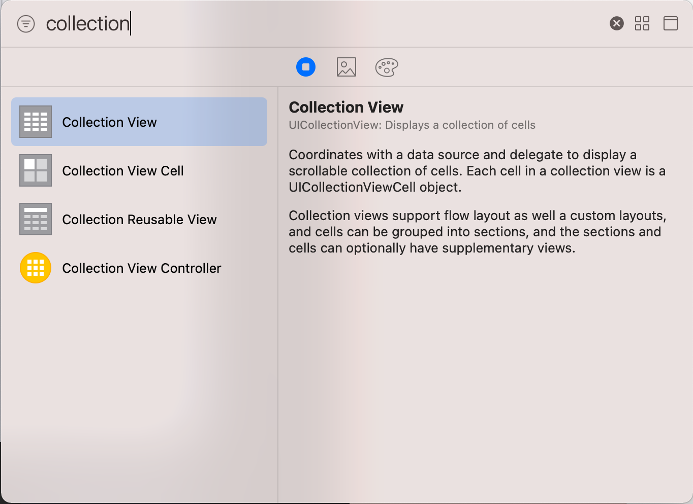

You can then setup the auto layout constraints to pin the collection view to the leading, trailing, top and bottom edges of the storyboard:

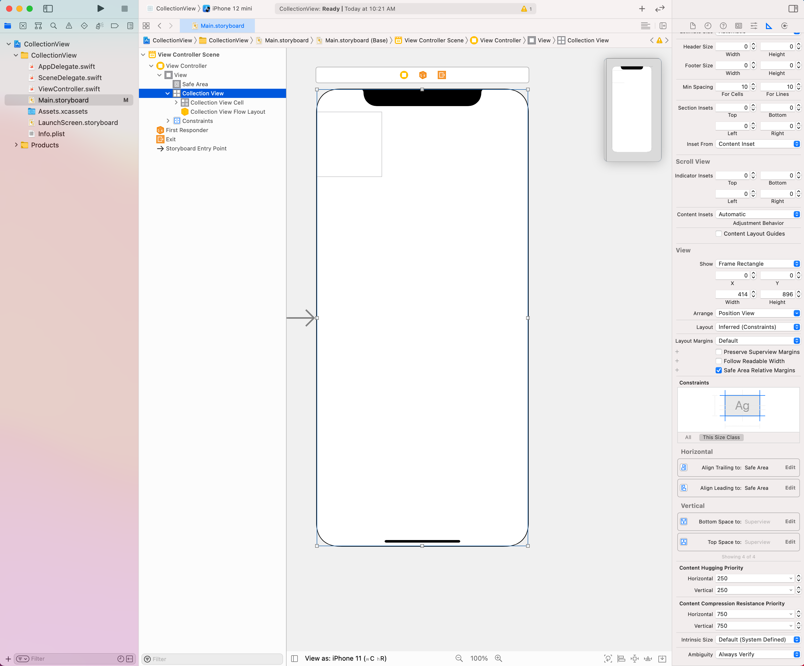

There are 2 types of ```UICollectionViewFlowLayout```'s that you can use with Collection Views:

1. Flow Layout (< iOS 13)
2. Compositional Layout (> iOS 13)

The next step is to create an IBOutlet from that Collection View to your View Controller (self-explanatory).

### Configuring the UICollectionViewLayout object in the Collection View

A collection view has a property called ```collectionViewLayout``` property where you need to set the type of layout you want to use.  We can set this property in ```viewDidLoad()```:

```swift
    override func viewDidLoad() {
        super.viewDidLoad()
        collectionView.collectionViewLayout = configureLayout()
    }
```

The ```configureLayout()``` method will need to return a ```UICollectionViewCompositionalLayout``` object which is a subclass of ```UICollectionViewLayout```.

In Compositional Layouts, we have the concept of an ```item```, ```group``` and a ```section```.

An ```item``` is structured like this:

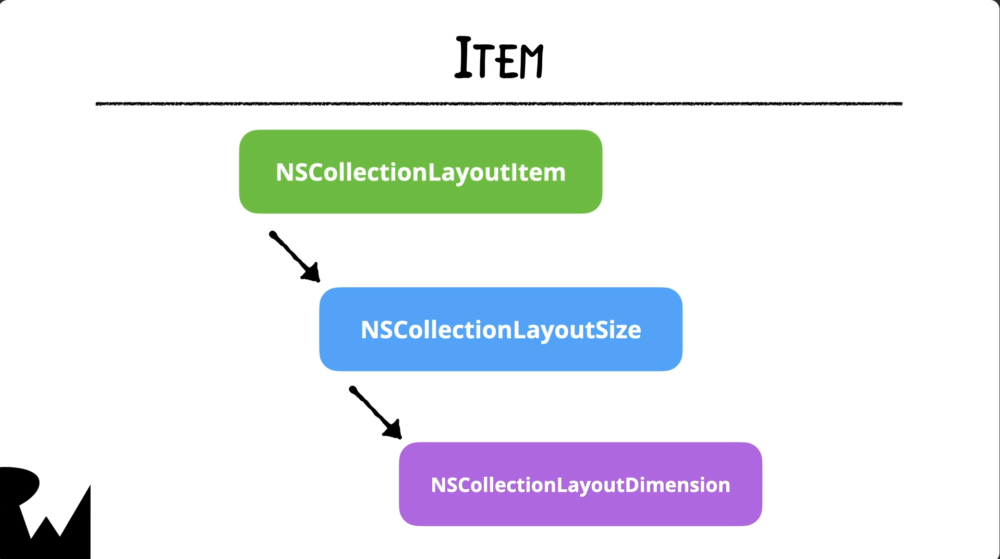

So, an item is "sized" using an ```NSCollectionLayoutDimension```.  There are 3 ways of configuring an ```NSCollectionLayoutDimension```:

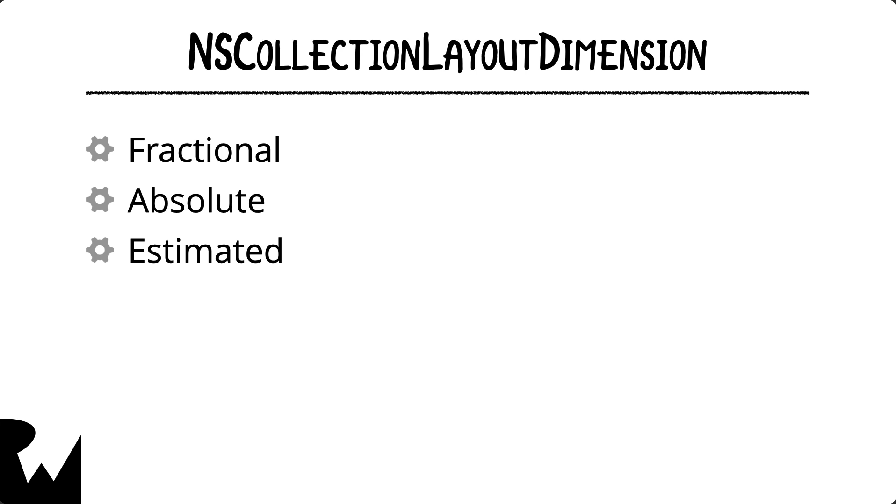

- estimated: useful for displaying items that display content; it's sized to the content it contains
- fractional: size according to a fractional size of the container it is in (values: 0 to 1)
- absolute: a fixed size in points (ie. 44 points)

As an example, here is how ```configureLayout()``` would work if we configured the item, group and section:

```swift
    func configureLayout() -> UICollectionViewCompositionalLayout {
        let itemSize = NSCollectionLayoutSize(widthDimension: .fractionalWidth(1.0), heightDimension: .fractionalHeight(1.0))
        let item: NSCollectionLayoutItem = NSCollectionLayoutItem(layoutSize: itemSize)
        
        let groupSize = NSCollectionLayoutSize(widthDimension: .fractionalWidth(1.0), heightDimension: .absolute(44))
        let group: NSCollectionLayoutGroup = NSCollectionLayoutGroup.horizontal(layoutSize: groupSize, subitems: [item])
        
        let section: NSCollectionLayoutSection = NSCollectionLayoutSection(group: group)
        
        return UICollectionViewCompositionalLayout(section: section)
    }
```

**Note** the return statement.  You have to make call to ```UICollectionViewCompositionalLayout(section:)``` in order to return the proper object.

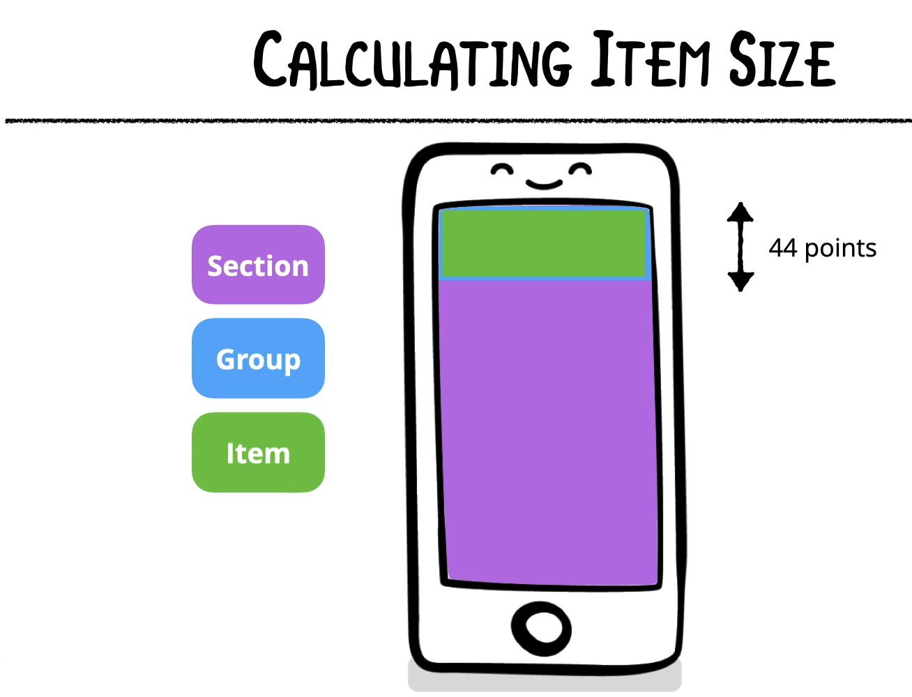

### Important Difference between Table Views and Collection Views

It's important to note that when you add a ```UITableView``` to your storyboard, a placeholder cell is created automatically.  Whereas, with ```UICollectionView```'s that is not the case.  You need to create the ```UICollectionViewCell``` yourself.

### Creating the UICollectionViewCell

You can set the Collection View Cell's size to "Custom" in the storyboard and give it a certain height and width, however, this doesn't necessarily mean that this size will be what you see when you run the app.  The UICollectionViewFlowLayout can override these settings.  

<em>So why do this in the storyboard?</em> It's used mainly to visually get an idea of what the cell __may__ look like.

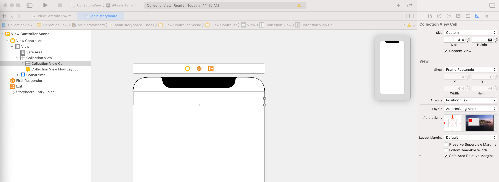

The next steps would be to:
1. Add any UI elements inside the prototype cell
2. Use Auto Layout to constrain those elements
3. Go to the Attributes Inspector (with the Collection View Cell highlighted in the Document Outline) and set the reuse identifier
4. Create a custom class that subclasses ```UICollectionViewCell```
5. Click on the Collection View cell in the Storyboard and go to the Attributes Inspector.  Set the class to the newly created class
6. Create any ```IBOutlet```s that you need to create in the new custom cell class

### What is the Diffable Data Source?

A collection view has 2 main responsibilities:
1. The collection view layout
2. The data source

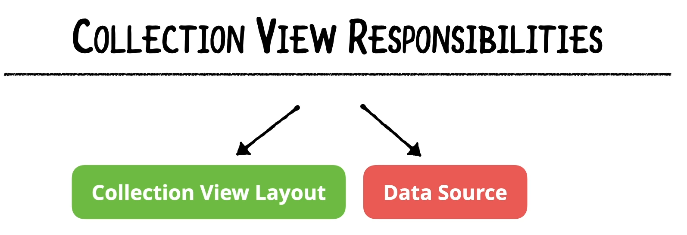

What does the Data Source actually do?


The snapshot is a recording of the current state of the UI, which is stored in the data source.

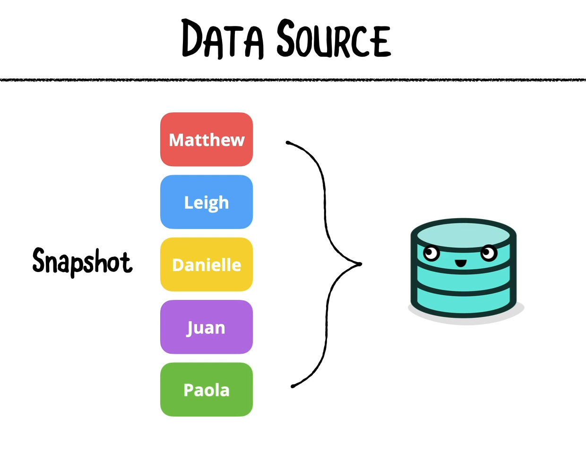

Once the data source has the updated snapshot, it can communicate to the Collection View and tell it what to display on screen:

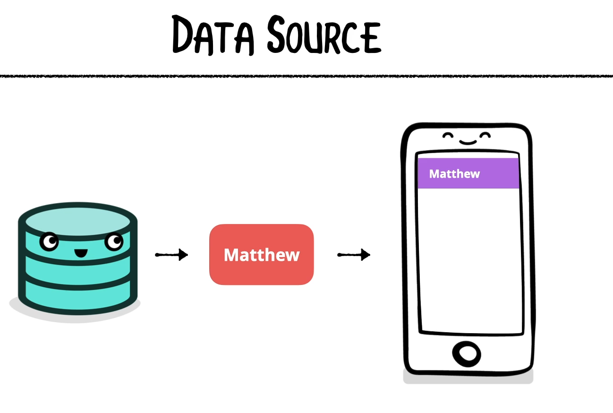

Any time the snapshot changes, the data source can "diff" the snapshots to determine what has changed.  This is what allows the DiffableDataSource to tell the Collection View how to reorder it's contents.

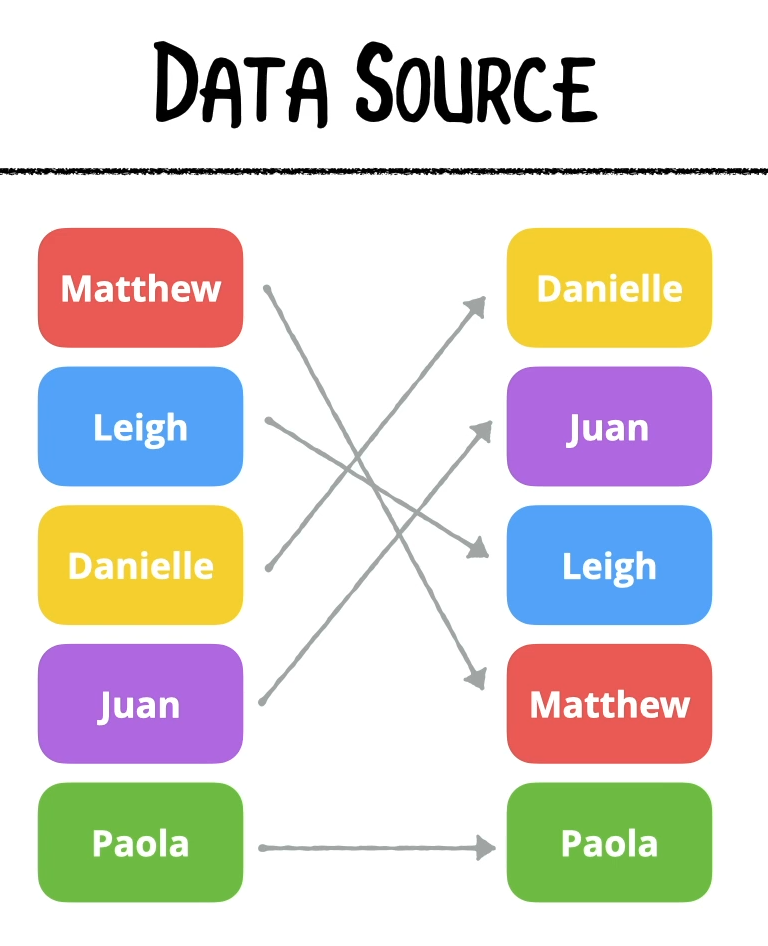

The Diffable Data source has two classes associated to it:
1. ```UICollectionViewDiffableDataSource```
2. ```NSDiffableDataSourceSnapshot```

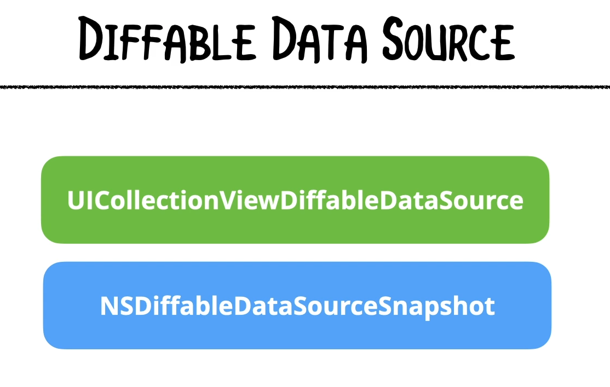

### Implementing Diffable Data Source

The first step to implement Diffable Data sources is to setup a strong reference to the Diffable Data Source at the top of your view controller:

```swift
let dataSource: UICollectionViewDiffableDataSource<<#SectionIdentifierType: Hashable#>, <#ItemIdentifierType: Hashable#>>
```

As you can see from the method signature (as well as the link below), the diffable data source is a generic class that takes 2 typed parameters:
1. A section class
2. An item class

Both of these classes conform to the ```Hashable``` protocol which means you need to use a unique identifier to identify the section and an item.

**If you have only 1 section in your app**, you can simply use an enum with a single case in it to indicate the single section in the app:

```swift
    enum Section {
        case main
    }
```

So, we can now setup the data source:

```swift
let dataSource: UICollectionViewDiffableDataSource<Section, Int>
```

The ```Section``` is coming from the enum which maps to the Sections in the data, but since we are only displaying integers on the screen in this example the item can be of type ```Int```.

Now, the View Controller will throw an error indicating that you must initialize the class.  <em>We have to reference the collection view to do that</em>.  We can either do the following:
1. Explicitly unwrap optional representing the data source
2. Lazily load the data source

Therefore, we change the data source's declaration from ```let``` to ```var```. 

```swift
var dataSource: UICollectionViewDiffableDataSource<Section, Int>
```

Now, we can begin implementing the diffable data source.  The first step is to use the following method:

```swift

    func configureDataSource() {
        // The 2nd argument is a closure that tells the collection view how to map the data to each cell
        // The closure accepts 3 arguments:
        // 1. the collection view to use
        // 2. index path of the cell
        // 3. the item identifier (or UUID) of the data to show (in this case it's an integer called number)
        dataSource = UICollectionViewDiffableDataSource<Section, Int>(collectionView: collectionView) { (collectionView, indexPath, number) -> UICollectionViewCell? in
            
        }
    }
```

***Note***, you must pass in the generic types after the method name.  For example, ```<Section, Int>```.

#### The 4 Key Parts of setting up a Diffable Data Source

```swift
        dataSource = UICollectionViewDiffableDataSource<Section, Int>(collectionView: collectionView) { (collectionView, indexPath, number) -> UICollectionViewCell? in
            // PART 1: Instruct the data source on how to setup a cell given a single item of data
            guard let cell = collectionView.dequeueReusableCell(withReuseIdentifier: NumberCell.reuseIdentifier, for: indexPath) as? NumberCell else {
                fatalError("Cannot create new cell")
            }
            cell.label.text = number.description
            return cell
        }
        // PART 2: Provide the data source with it's initial snapshot
        var initialSnapshot = NSDiffableDataSourceSnapshot<Section, Int>() // Snapshot defines it's data in terms of sections and items
        initialSnapshot.appendSections([.main]) // Add a section using appendSections, it is passed an array of sections
        // PART 3: Add items to the section
        initialSnapshot.appendItems(Array(1...100), toSection: .main) // If there is only 1 section, you can omit the toSection: parameter
        // PART 4: Apply the snapshot to the datasource
        dataSource.apply(initialSnapshot, animatingDifferences: false)
    }

```

From the snippet above, the key parts are:
1. Instruct the data source on how to setup a cell given a single item of data
2. Provide the data source with it's initial snapshot; you must also add any sections you need
3. Add items to the section (if you have a single section, you can omit the ```toSection:``` parameter from ```appendItems(_: toSection:)```
4. Apply the snapshot to the data source

Considering that we have not applied anytype of formatting to the UICollectionViewCell and have not added any code in the ```configureLayout()``` method to make the layout look more like a grid, the following steps will accomplish that.  Let's say I want a grid with 5 columns (perfect squares).  You would need to make the following changes:

```swift
    func configureLayout() -> UICollectionViewCompositionalLayout {
        let itemSize = NSCollectionLayoutSize(widthDimension: .fractionalWidth(0.2), heightDimension: .fractionalHeight(1.0))
        let item: NSCollectionLayoutItem = NSCollectionLayoutItem(layoutSize: itemSize)
        item.contentInsets = NSDirectionalEdgeInsets(top: 5, leading: 5, bottom: 5, trailing: 5)

        let groupSize = NSCollectionLayoutSize(widthDimension: .fractionalWidth(1.0), heightDimension: .fractionalWidth(0.2))
        let group: NSCollectionLayoutGroup = NSCollectionLayoutGroup.horizontal(layoutSize: groupSize, subitems: [item])
        group.contentInsets = NSDirectionalEdgeInsets(top: 2, leading: 2, bottom: 2, trailing: 2)

        let section: NSCollectionLayoutSection = NSCollectionLayoutSection(group: group)
        section.contentInsets = NSDirectionalEdgeInsets(top: 8, leading: 8, bottom: 8, trailing: 8)

        return UICollectionViewCompositionalLayout(section: section)
    }
```

**Note**, the use of ```contentInsets``` to add spacing around items, groups and sections.

Then, in ```configureDataSource()``` you'd need to add some configuration to the cell in ```configureDataSource()```

```swift
            cell.backgroundColor = .systemTeal
            cell.label.textColor = .white
            cell.layer.borderWidth = 0.75;
            cell.layer.borderColor = UIColor.red.cgColor
            cell.layer.masksToBounds = true
            cell.clipsToBounds = true
```

Here's what you would see after these changes:

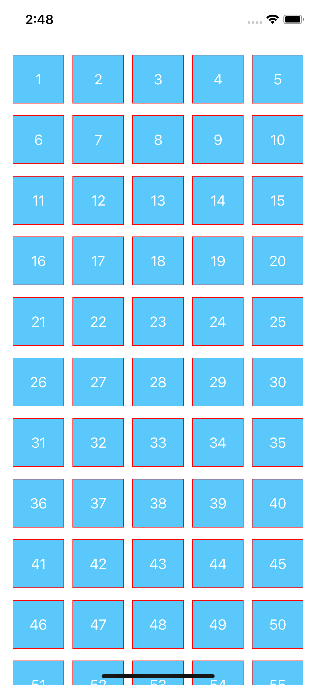

[Diffable Data Sources](https://developer.apple.com/documentation/uikit/uicollectionviewdiffabledatasource#)


Links:
[collectionViewLayout](https://developer.apple.com/documentation/uikit/uicollectionview/1618047-collectionviewlayout#)
