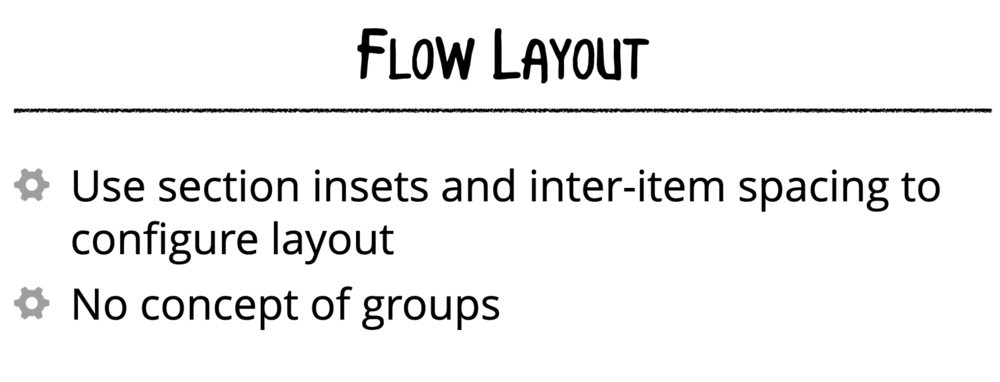
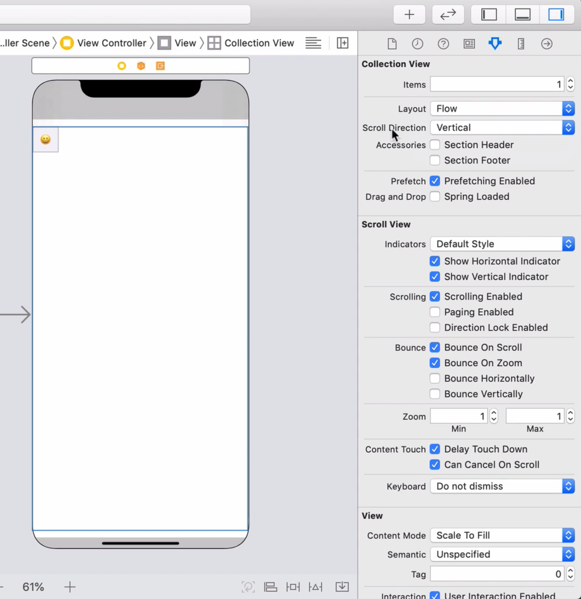
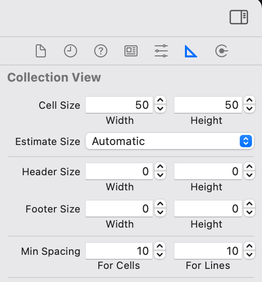

## Creating a Collection View using Flow Layout (Storyboard)

### Flow Layout Objects & Creating a Flow Layout in IB

There are advantages and disadvantages of using Compositional Layout.  A few disadvantages include:
- It is only available in iOS 13 and above
- It has limited functionality as it is still considered to be new (is this still the case in 2021?)


The old method of creating a UICollectionView include:

- Creating the flow layout
- Creating the data source


```UICollectionViewLayout``` has 2 concrete subclasses that can be used.  In iOS 12 and before, you would need to use ```UICollectionViewFlowLayout```.  In iOS 13 and above, you'd use ```UICollectionViewCompositionalLayout```.


Here is how the Flow Layout lays out cells in your collection view:


Features of Flow Layout:


You need to configure the item size through it's width and height properties so that the flow layout can layout the items.


We can also set inter item spacing and inter line spacing to give more breathing room to our cells.


Section Insets can also be added to push the entire collection view inwards or outwards:


Here are some differences between Flow Layout and Compositional Layout:



When creating a Compositional Layout, you specify the scroll direction at the group level.  Whereas, in a Flow Layout, you set it at the collection view level.

When the Scroll Direction property in Attributes Inspector is set to ```Vertical```, it means your collection view will be layed out in a series of rows.  ```Horizontal``` means columns.




A collection view's cell size (width & height), headers, footers and insets can all be configured within the Size Inspector:


One big advantage of using a Flow Layout is that the properties to change the way the collection view looks are all baked into the Storyboard.  For example, you can change the number of prototype cells displayed in the storyboard and then modify the cell spacing or line spacing to visually see how this will look in your UI.

**Note**, changing the number of prototype cells has no effect on what actually happens when your app runs.  This is just a visual feature of Storyboards.




### Setting up a Data Source

Remember, in a Flow Layout **any** object can act as the Collection View's data source.  Even the View Controller class that __contains__ the collection view can act as the collection view's data source.

To accomplish this, you would do the following:

1. Tell the collection view object in the View Controller that it's data source property is the view controller itself.  For example, in ```viewDidLoad()```:


```swift
collectionView.dataSource = self
```

2. Then, implement the required protocol methods that are part of ```UICollectionViewDataSource```:

```swift
extension ViewController: UICollectionViewDataSource {
    func collectionView(_ collectionView: UICollectionView, numberOfItemsInSection section: Int) -> Int {
        return 0 // replace with the correct code
    }

    func collectionView(_ collectionView: UICollectionView, cellForItemAt indexPath: IndexPath) -> UICollectionViewCell {
        return UICollectionViewCell() // replace with the correct code
    }
}
```

It's usually a better idea to implement the **Separation of Concerns** concept in regards to a ```UIViewController``` that has a ```UICollectionView``` inside of it and the data source associated to that ```UICollectionView```.

So, instead of the above method, we are going to do the following:

1. Remove any previous code or storyboard changes that were implemented to setup a data source.
2. Create a custom DataSource class that will contain all the necessary ```UICollectionViewDataSource``` methods:

```swift
import UIKit

class DataSource: NSObject, UICollectionViewDataSource {

    let emoji = Emoji.shared

    func collectionView(_ collectionView: UICollectionView, cellForItemAt indexPath: IndexPath) -> UICollectionViewCell {
        guard let emojiCell = collectionView.dequeueReusableCell(withReuseIdentifier: EmojiCell.reuseIdentifier, for: indexPath) as? EmojiCell else {
            fatalError("Cell cannot be created!")
        }

        let category = emoji.sections[indexPath.section]
        let emoji = self.emoji.data[category]?[indexPath.item] ?? ""

        emojiCell.emojiLabel.text = emoji

        return emojiCell
    }

    func numberOfSections(in collectionView: UICollectionView) -> Int {
        return emoji.sections.count
    }

    func collectionView(_ collectionView: UICollectionView, numberOfItemsInSection section: Int) -> Int {
        return self.emoji.data[emoji.sections[section]]?.count  ?? 0
    }
}
```

3. In your View Controller, create a variable with a strong reference to the data source:

```swift
let dataSource = DataSource()
```

4. Associate this new ```DataSource``` instance to the collection view's ```dataSource``` property:

```swift
collectionView.dataSource = dataSource
```

### Adjusting Layout in Code

One noticeable difference between using Compositional Layout and Flow Layouts is that you cannot configure (in Interface Builder) the spacing between cells and the number of cells in each row like you can when you use ```NSCollectionLayoutDimension```.

What we can do, however, is use the flow layout delegate to provide information about the layout.  We will use a similar approach as we did with the data source and decouple the integration.


1. Implement a new class:
```swift
import UIKit

class EmojiCollectionViewDelegate: NSObject, UICollectionViewDelegateFlowLayout {

}
```

2. Implement the required methods:
```swift

let numberOfItemsPerRow: CGFloat
let interItemSpacing: CGFloat

init(numberOfItemsPerRow: CGFloat, interItemSpacing: CGFloat) {
    self.numberOfItemsPerRow = numberOfItemsPerRow
    self.interItemSpacing = interItemSpacing
}

func collectionView(_ collectionView: UICollectionView, layout collectionViewLayout: UICollectionViewLayout, sizeForItemAt indexPath: IndexPath) -> CGSize {
    let maxWidth = UIScreen.main.bounds.width
    let totalSpacing = interItemSpacing * numberOfItemsPerRow
    let itemWidth = (maxWidth - totalSpacing)/numberOfItemsPerRow
    return CGSize(width: itemWidth, height: itemWidth)
}

func collectionView(_ collectionView: UICollectionView, layout collectionViewLayout: UICollectionViewLayout, minimumInteritemSpacingForSectionAt section: Int) -> CGFloat {
    return interItemSpacing
}
```

3. Wire up the collection view's delegate in the View Controller:

```swift
import UIKit

class ViewController: UIViewController {

    @IBOutlet weak var collectionView: UICollectionView!
    let dataSource = DataSource()
    let delegate = EmojiCollectionViewDelegate(numberOfItemsPerRow: 6, interItemSpacing: 8)

    override func viewDidLoad() {
        super.viewDidLoad()
        // Do any additional setup after loading the view.
        collectionView.dataSource = dataSource
        collectionView.delegate = delegate
    }
}
```

If you run the app at this point, the sections will be touching each other (vertically) as you have not indicated any sort of spacing between sections (ie. content insets)

4. Implement the following delegate method:

```swift
func collectionView(_ collectionView: UICollectionView, layout collectionViewLayout: UICollectionViewLayout, insetForSectionAt section: Int) -> UIEdgeInsets {
    return UIEdgeInsets(top: 15, left: 20, bottom: 15, right: 20)
}
```

Reference: [UICollectionViewDelegateFlowLayout](https://developer.apple.com/documentation/uikit/uicollectionviewdelegateflowlayout?language=objc#)
